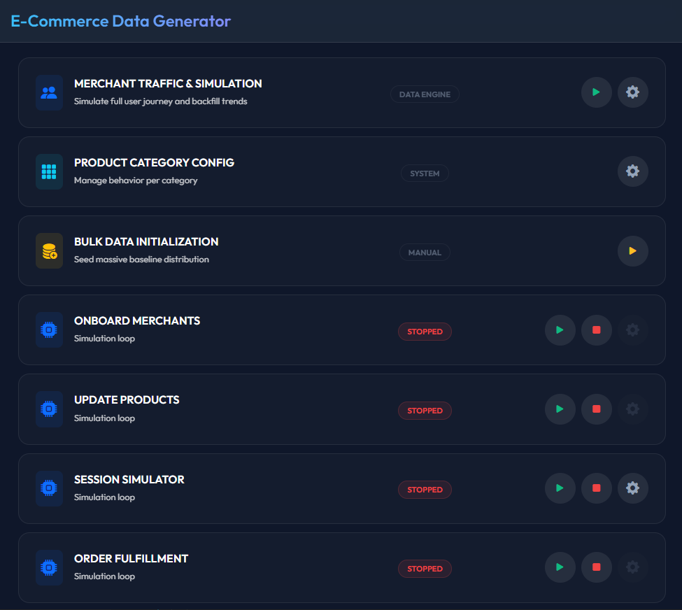
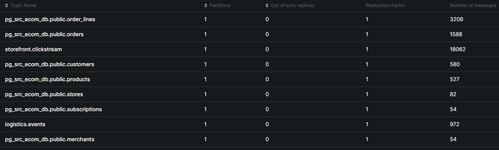

# Real-Time E-Commerce Data Platform

## About This Project
This is an **experimental sandbox project**. I built it to learn and practice modern data engineering tools. The goal is to mimic the real-time data architecture of high-growth e-commerce platforms.

It captures database changes (CDC) and user clickstream events, processes them in real-time, and stores them in a fast analytical database.

## Architecture & Tech Stack
- **Transactional Database:** PostgreSQL
- **Change Data Capture (CDC):** Debezium
- **Message Broker:** Apache Kafka
- **Stream Processing:** Apache Flink
- **OLAP Data Warehouse:** ClickHouse


## How to Use?

- Clone the project
  ```bash
  git clone https://github.com/Al-Moatasem/realtime-e-commerce-data-platform.git
  ```
- Copy the `.env.example` to `.env` and update its values
- Start the docker services
  ```bash
  # Run necessary docker services (excluding flink)
  docker compose -f infra/docker_compose/docker_compose.yaml up db kafka kafka-ui connect clickhouse -d

  # Or, Run all services
  docker compose -f infra/docker_compose/docker_compose.yaml up -d
  ```
  - The docker file include two services for Apache Flink, Flink is not used heavily on this project at this point (we only tested the connection from Flink to Kafka and ClickHouse)
  - The `db` service will
    - Create a postgres database named `ecommerce_db`
    - Create the application tables (merchants, stores, products, ...). (check: `infra\postgres\init\01_application_tables.sql`)
    - Create `debezium_user` user for the CDC tasks (check: `infra\postgres\init\02_debezium_user.sql`).
  - The `clickhouse` service will
    - Create a database named `dwh`, with one or more tables (check: `infra\clickhouse\config\init`)


### Web Applications - Data Faker
We have two separate FastAPI applications:
1. generating random clickstream events and push them into Kafka, and insert necessary records into a Postgres database
2. Consuming data from the ClickHouse database and feed the Merchant and Store dashboards.

---

- Navigate to the `data_faker` directory and create the Python virtual environment
  ```bash
  cd data_faker
  uv sync
  .venv/scripts/activate # Linux: source .venv/bin/activate
  ```
- Start the data faker application
  ```bash
  uv run uvicorn main:app --port 8000 --reload
  ```
- Open the data faker web application `http://localhost:8000`
  - The application depends on the Kafka service, if the Kafka Docker service was not yet started, the UI will display a warning, wait till the Kafka Service is up and running, then restart the data faker application (open `data_faker/main.py` and press **ctrl+s** to trigger the restart)

  

- We have different option to generate data
  - Use the play button for **MERCHANT TRAFFIC & SIMULATION** card to generate a random merchant with one/multiple stores, products, customers, orders on the Postgres database, and publish click events to Kafka, it will prompt a window with number of days for the historical data (default is 65 days)
    - We can trigger multiple data generation actions in the same time
  - Generate a continuous stream of events
    1. Seed the database with merchants, stores, products, customers through the **BULK DATA INITIALIZATION** play button
    2. Generate clickstream events through the **SESSION SIMULATOR** play button.
    3. Start a process that update the order status on the Postgres database through the **ORDER FULFILLMENT** play button.

    > We can run both session simulator and order fulfillment in the same time

### Kafka Connect / Debezium
- While replicating Postgres data into Kafka through Debezium, the default configurations will result in receiving only the `after` state, if we need to receive both the `before` and `after` states of the records, we need to set the replica set to true per table
  - Open the postgres container terminal and access the `psql`
    ```bash
    docker exec -it db bash
    psql -U app_admin -d ecommerce_db -w

    ```
  - Generate the SQL statements for available tables
    ```sql
    SELECT 'ALTER TABLE ' || quote_ident(schemaname) || '.' || quote_ident(tablename) || ' REPLICA IDENTITY FULL;'
    FROM pg_tables
    WHERE TRUE
        AND schemaname IN ('public')
        AND tablename NOT IN ('alembic_version')
    ;
    ```
  - Execute the result queries (the below queries)
    ```sql
    ALTER TABLE public.merchants REPLICA IDENTITY FULL;
    ALTER TABLE public.customers REPLICA IDENTITY FULL;
    ALTER TABLE public.orders REPLICA IDENTITY FULL;
    ALTER TABLE public.stores REPLICA IDENTITY FULL;
    ALTER TABLE public.subscriptions REPLICA IDENTITY FULL;
    ALTER TABLE public.order_lines REPLICA IDENTITY FULL;
    ALTER TABLE public.products REPLICA IDENTITY FULL;
    ```
- create the cdc connector that replicate data from Postgres db into Kafka
  ```bash
  curl -i -X PUT "http://localhost:8083/connectors/jdbc-pg-source-ecom-db/config" \
      -H "Accept:application/json" -H "Content-Type:application/json" \
      -d @streaming/connect/01_jdbc_source_postgres_ecommerce.json
  ```
  The expected response should be like this
  ```json
  {"name":"jdbc-pg-source-ecom-db","config":{"connector.class":"io.debezium.connector.postgresql.PostgresConnector",..."name":"jdbc-pg-source-ecom-db"},"tasks":[],"type":"source"}
  ```
- Check the status of the connector and its task
  ```bash
  curl -s "http://localhost:8083/connectors/jdbc-pg-source-ecom-db/status"
  ```
  expected response (we should expect `state = RUNNING` for both the connector and the task)
  ```json
  {
    "name":"jdbc-pg-source-ecom-db",
    "connector":{ "state":"RUNNING","worker_id":"172.18.0.6:8083","version":"3.5.0.Final"},
    "tasks":[{"id":0,"state":"RUNNING","worker_id":"172.18.0.6:8083","version":"3.5.0.Final"}],
    "type":"source"
  }
  ```
- We can check the created topics and replicated records through [kafka-ui](http://localhost:8080/ui/clusters/local-kafka/all-topics) (`http://localhost:8080/ui/clusters/local-kafka/all-topics`)

  

### ClickHouse
- As mentioned before, when we start the ClickHouse docker service for the first time, a new database named `dwh` will be created.
- In a new terminal, open the ClickHOuse container's terminal then open the ClickHouse client
  ```bash
  docker exec -it clickhouse-server bash

  # the credentials were defined in the docker compose file
  clickhouse client --user admin --password pass_adwin_road
  ```

#### Replicating Data from Kafka to ClickHouse
We are going to replicate the Kafka messages into ClickHouse tables (raw zone), create different tables to feed the merchant and store dashboards (reporting zone), create materialized views to populate the tables in reporting zone from the tables in the raw zone

##### Clickstream Events
##### Stores
- A clean structure table for stores
  ```sql
  DROP TABLE IF EXISTS dwh.kafka_pg_app_stores;
  CREATE TABLE dwh.kafka_pg_app_stores (
      store_id String,
      merchant_id String,
      store_region LowCardinality(String),
      store_status LowCardinality(String),
      store_name String,
      created_at DateTime(3),
      updated_at DateTime(3)
      )
  ENGINE = ReplacingMergeTree(updated_at)
  ORDER BY (merchant_id, store_id)
  ;
  ```
- A connection between Kafka and ClickHouse, it doesn't store data
  ```sql
  DROP TABLE IF EXISTS dwh.raw_kafka_pg_app_stores;
  CREATE TABLE dwh.raw_kafka_pg_app_stores (
       message String
  )
  ENGINE = Kafka
  SETTINGS
       kafka_broker_list = 'kafka:29092',
       kafka_topic_list = 'pg_src_ecom_db.public.stores',
       kafka_group_name = 'clickhouse_pg_app_stores_group',
       kafka_format = 'JSONAsString',
       kafka_thread_per_consumer = 0,
       kafka_num_consumers = 1
  ;
  ```
- We can list the created tables
  ```sql
  USE dwh;
  SHOW tables;
  ```
- A materialized view that will pull data from the raw table `dwh.raw_kafka_pg_app_stores` (raw table consume from Kafka topic) and insert it to the reporting table `dwh.kafka_pg_app_stores`. The View will parse the Kafka message (json format, and extract the attributes/keys we are interested in)
  ```sql
  DROP VIEW IF EXISTS dwh.kafka_pg_app_stores_mv;
  CREATE MATERIALIZED VIEW dwh.kafka_pg_app_stores_mv
  TO dwh.kafka_pg_app_stores
  AS
  SELECT
      JSONExtractString(message, 'payload', 'after','store_id') AS store_id,
      JSONExtractString(message, 'payload', 'after','merchant_id') AS merchant_id,
      JSONExtractString(message, 'payload', 'after','region') AS store_region,
      JSONExtractString(message, 'payload', 'after','status') AS store_status,
      JSONExtractString(message, 'payload', 'after','name') AS store_name,
      parseDateTime64BestEffort(JSONExtractString(message,'payload','after', 'created_at'),6) AS created_at,
      parseDateTime64BestEffort(JSONExtractString(message, 'payload','after', 'updated_at'),6) AS updated_at
  FROM dwh.raw_kafka_pg_app_stores
  ;
  ```
- Check the data in the table (we may need to wait a bit till data got replicated)
  ```sql
  SELECT COUNT(*)  FROM dwh.kafka_pg_app_stores;
  ```
##### Products
```sql
DROP TABLE IF EXISTS dwh.kafka_pg_app_products;
CREATE TABLE dwh.kafka_pg_app_products (
    product_id String,
    merchant_id String,
    store_id String,
    product_sku String,
    product_name String,
    product_category LowCardinality(String),
    unit_price Decimal(10,2),
    created_at DateTime(3),
    updated_at DateTime(3)
    )
ENGINE = ReplacingMergeTree(updated_at)
ORDER BY (merchant_id, store_id, product_id)
;
```
```sql
DROP TABLE IF EXISTS dwh.raw_kafka_pg_app_products;
CREATE TABLE dwh.raw_kafka_pg_app_products (
      message String
)
ENGINE = Kafka
SETTINGS
      kafka_broker_list = 'kafka:29092',
      kafka_topic_list = 'pg_src_ecom_db.public.products',
      kafka_group_name = 'clickhouse_pg_app_products_group',
      kafka_format = 'JSONAsString',
      kafka_thread_per_consumer = 0,
      kafka_num_consumers = 1
;
```
```sql
DROP VIEW IF EXISTS dwh.kafka_pg_app_products_mv;
CREATE MATERIALIZED VIEW dwh.kafka_pg_app_products_mv
TO dwh.kafka_pg_app_products
AS
SELECT
    JSONExtractString(message, 'payload', 'after','product_id') AS product_id,
    JSONExtractString(message, 'payload', 'after','merchant_id') AS merchant_id,
    JSONExtractString(message, 'payload', 'after','store_id') AS store_id,
    JSONExtractString(message, 'payload', 'after','category') AS product_category,
    JSONExtractString(message, 'payload', 'after','sku') AS product_sku,
    JSONExtractString(message, 'payload', 'after','name') AS product_name,
    parseDateTime64BestEffort(JSONExtractString(message,'payload','after', 'created_at'),6) AS created_at,
    parseDateTime64BestEffort(JSONExtractString(message, 'payload','after', 'updated_at'),6) AS updated_at

FROM dwh.raw_kafka_pg_app_products
;
```
```sql
SELECT COUNT(*) FROM dwh.kafka_pg_app_products;
```

##### Orders
```sql
DROP TABLE IF EXISTS dwh.kafka_pg_app_orders;
CREATE TABLE dwh.kafka_pg_app_orders
(
    order_id String,
    merchant_id String,
    store_id String,
    customer_id String,
    order_status String,
    total_amount Decimal(10,2),
    created_at DateTime64(3),
    updated_at DateTime64(3)
)
ENGINE = ReplacingMergeTree(updated_at)
PARTITION BY toYYYYMM(created_at)
ORDER BY (merchant_id, store_id, toDate(created_at), order_id)
;
```
```sql
DROP TABLE IF EXISTS dwh.raw_kafka_pg_app_orders;
CREATE TABLE dwh.raw_kafka_pg_app_orders (
      message String
)
ENGINE = Kafka
SETTINGS
      kafka_broker_list = 'kafka:29092',
      kafka_topic_list = 'pg_src_ecom_db.public.orders',
      kafka_group_name = 'clickhouse_pg_app_orders_group',
      kafka_format = 'JSONAsString',
      kafka_thread_per_consumer = 0,
      kafka_num_consumers = 1
;
```
```sql
DROP VIEW IF EXISTS dwh.kafka_pg_app_orders_mv;
CREATE MATERIALIZED VIEW dwh.kafka_pg_app_orders_mv
TO dwh.kafka_pg_app_orders
AS
SELECT
    JSONExtractString(message, 'payload', 'after','order_id') AS order_id,
    JSONExtractString(message, 'payload', 'after','merchant_id') AS merchant_id,
    JSONExtractString(message, 'payload', 'after','store_id') AS store_id,
    JSONExtractString(message, 'payload', 'after','customer_id') AS customer_id,
    JSONExtractString(message, 'payload', 'after','order_status') AS order_status,

    -- Avoid using JSONExtractFloat as it imprecise
    toDecimal64(
      JSONExtractString(message, 'payload', 'after', 'total_amount'), 2
    ) AS total_amount,


    parseDateTime64BestEffort(JSONExtractString(message,'payload','after', 'created_at'),6) AS created_at,
    parseDateTime64BestEffort(JSONExtractString(message, 'payload','after', 'updated_at'),6) AS updated_at
FROM dwh.raw_kafka_pg_app_orders
;
```
```sql
SELECT COUNT(*) FROM dwh.kafka_pg_app_orders
```

##### Order Lines
```sql
DROP TABLE IF EXISTS dwh.kafka_pg_app_order_lines;
CREATE TABLE dwh.kafka_pg_app_order_lines
(
    order_line_id String,
    order_id String,
    product_id String,
    quantity UInt32,
    unit_price Decimal(10,2),
    created_at DateTime64(3),
    updated_at DateTime64(3)
)
ENGINE = ReplacingMergeTree(updated_at)
PARTITION BY toYYYYMM(created_at)
ORDER BY (order_id, toDate(created_at), order_line_id)
;
```
```sql
DROP TABLE IF EXISTS dwh.raw_kafka_pg_app_order_lines;
CREATE TABLE dwh.raw_kafka_pg_app_order_lines (
      message String
)
ENGINE = Kafka
SETTINGS
      kafka_broker_list = 'kafka:29092',
      kafka_topic_list = 'pg_src_ecom_db.public.order_lines',
      kafka_group_name = 'clickhouse_pg_app_order_lines_group',
      kafka_format = 'JSONAsString',
      kafka_thread_per_consumer = 0,
      kafka_num_consumers = 1
;
```
```sql
DROP VIEW IF EXISTS dwh.kafka_pg_app_order_lines_mv;
CREATE MATERIALIZED VIEW dwh.kafka_pg_app_order_lines_mv
TO dwh.kafka_pg_app_order_lines
AS
SELECT
    JSONExtractString(message, 'payload', 'after','order_line_id') AS order_line_id,
    JSONExtractString(message, 'payload', 'after','order_id') AS order_id,
    JSONExtractString(message, 'payload', 'after','product_id') AS product_id,
    JSONExtractInt(message, 'payload', 'after','quantity') AS quantity,
    toDecimal64(
      JSONExtractString(message, 'payload', 'after', 'unit_price'), 2
    ) AS unit_price,
    parseDateTime64BestEffort(JSONExtractString(message,'payload','after', 'created_at'),6) AS created_at,
    parseDateTime64BestEffort(JSONExtractString(message, 'payload','after', 'updated_at'),6) AS updated_at
FROM dwh.raw_kafka_pg_app_order_lines
;
```
```sql
SELECT COUNT(*) FROM dwh.kafka_pg_app_order_lines
```

##### Clickstream Events
```sql
DROP TABLE IF EXISTS dwh.kafka_storefront_clickstream;
CREATE TABLE dwh.kafka_storefront_clickstream
(
    event_name LowCardinality(String),
    session_id String,
    ts DateTime64(3),
    store_id String,
    customer_id String,
    product_id String,
    action LowCardinality(String),
    quantity UInt16,
    unit_price Decimal(10,2),
    cart_item_count UInt16,
    expected_total Decimal(18,2)
)
ENGINE = MergeTree
PARTITION BY toYYYYMM(ts)
ORDER BY (store_id, toDate(ts), event_name, session_id)
;
```
```sql
DROP TABLE IF EXISTS dwh.raw_kafka_storefront_clickstream;
CREATE TABLE dwh.raw_kafka_storefront_clickstream (
    event_name String,
    session_id String,
    `timestamp` String,
    store_id String,
    customer_id String,
    -- event specific fields
    product_id String,
    action LowCardinality(String),
    quantity UInt16,
    unit_price Decimal,
    cart_item_count UInt16,
    expected_total Decimal
)
ENGINE = Kafka
SETTINGS
    kafka_broker_list = 'kafka:29092',
    kafka_topic_list = 'storefront.clickstream',
    kafka_group_name = 'clickhouse_storefront_group',
    kafka_format = 'JSONEachRow'
;
```
```sql
DROP VIEW IF EXISTS dwh.kafka_storefront_clickstream_mv;
CREATE MATERIALIZED VIEW dwh.kafka_storefront_clickstream_mv
TO dwh.kafka_storefront_clickstream
AS
SELECT
    event_name,
    session_id,
    parseDateTime64BestEffort(`timestamp`) AS ts,
    store_id,
    customer_id,
    product_id,
    action,
    quantity,
    unit_price,
    cart_item_count,
    expected_total
FROM dwh.raw_kafka_storefront_clickstream;
```
```sql
SELECT COUNT(*) FROM dwh.kafka_storefront_clickstream;
```

#### Creating Tables for Reporting Layer
- A table with `AggregatingMergeTree` doesn't store data. They store mathematical aggregations and highly compressed binary "states" for distinct counts.

##### Store Hourly KPIs
- The AggregatingMergeTree definition
  ```sql
  DROP TABLE IF EXISTS dwh.agg_hourly_merchant_store_kpis;
  CREATE TABLE dwh.agg_hourly_merchant_store_kpis
  (
      `merchant_id` String,
      `store_id` String,
      `ts_hour` DateTime,

      `total_revenue` SimpleAggregateFunction(sum, Decimal(38,2)),
      `total_orders` SimpleAggregateFunction(sum, UInt64),
      `page_views` SimpleAggregateFunction(sum, UInt64),
      `cart_actions` SimpleAggregateFunction(sum, UInt64),

      `active_customers_state` AggregateFunction(uniq, String),
      `unique_visitors_state` AggregateFunction(uniq, String)
  )
  ENGINE = AggregatingMergeTree()
  PARTITION BY toYYYYMM(ts_hour)
  ORDER BY (merchant_id, store_id, ts_hour);
  ```
- The materialized view to populate the table (works with newly inserted data)
  ```sql
  DROP VIEW IF EXISTS dwh.agg_hourly_merchant_store_kpis_mv;
  CREATE MATERIALIZED VIEW dwh.agg_hourly_merchant_store_kpis_mv
  TO dwh.agg_hourly_merchant_store_kpis
  AS SELECT
      s.merchant_id AS merchant_id,
      e.store_id AS store_id,
      toStartOfHour(e.ts) AS ts_hour,

      /*sum(if(e.event_name = 'checkout_started', e.expected_total, 0)) AS total_revenue,*/
      sumIf(e.expected_total, e.event_name = 'checkout_started') AS total_revenue,

      /* count(if(e.event_name = 'checkout_started', 1, NULL)) AS total_orders,*/
      countIf(e.event_name = 'checkout_started') AS total_orders,

      countIf(e.event_name = 'page_view') AS page_views,
      countIf(e.event_name = 'cart_action') AS cart_actions,

      uniqIfState(e.customer_id, e.event_name = 'checkout_started') AS active_customers_state,
      uniqState(e.session_id) AS unique_visitors_state

  FROM dwh.kafka_storefront_clickstream AS e
  LEFT JOIN dwh.kafka_pg_app_stores AS s ON e.store_id = s.store_id
  GROUP BY
      merchant_id,
      store_id,
      ts_hour;
  ```

- Populating the table with current data (This approach works in our case, as we can stop data generation, in a production environment, we need to apply a suitable backfilling approach)
  ```sql
  INSERT INTO dwh.agg_hourly_merchant_store_kpis
  SELECT
      s.merchant_id AS merchant_id,
      e.store_id AS store_id,
      toStartOfHour(e.ts) AS ts_hour,

      sumIf(e.expected_total, e.event_name = 'checkout_started') AS total_revenue,
      countIf(e.event_name = 'checkout_started') AS total_orders,
      countIf(e.event_name = 'page_view') AS page_views,
      countIf(e.event_name = 'cart_action') AS cart_actions,

      uniqIfState(e.customer_id, e.event_name = 'checkout_started') AS active_customers_state,
      uniqState(e.session_id) AS unique_visitors_state

  FROM dwh.kafka_storefront_clickstream AS e
  LEFT JOIN dwh.kafka_pg_app_stores AS s ON e.store_id = s.store_id
  GROUP BY
      merchant_id,
      store_id,
      ts_hour;
  ```
##### Store / Product Daily Sales
```sql
DROP TABLE IF EXISTS dwh.agg_daily_product_sales;
CREATE TABLE dwh.agg_daily_product_sales
(
    `merchant_id` String,
    `store_id` String,
    `product_id` String,
    `ts_date` Date,
    `total_revenue` SimpleAggregateFunction(sum, Decimal(38,2)),
    `items_sold` SimpleAggregateFunction(sum, UInt64)
)
ENGINE = AggregatingMergeTree()
PARTITION BY toYYYYMM(ts_date)
ORDER BY (merchant_id, store_id, ts_date, product_id);
```
```sql
DROP VIEW IF EXISTS dwh.agg_daily_product_sales_mv;
CREATE MATERIALIZED VIEW dwh.agg_daily_product_sales_mv
TO dwh.agg_daily_product_sales
AS SELECT
    o.merchant_id AS merchant_id,
    o.store_id AS store_id,
    ol.product_id AS product_id,
    toDate(ol.created_at) AS ts_date,

    sum(toDecimal64(ol.quantity * ol.unit_price, 2)) AS total_revenue,
    sum(ol.quantity) AS items_sold
FROM dwh.kafka_pg_app_order_lines AS ol
LEFT JOIN dwh.kafka_pg_app_orders AS o ON ol.order_id = o.order_id
GROUP BY
    merchant_id,
    store_id,
    product_id,
    ts_date
;
```
populating the daily agg table
```sql
INSERT INTO dwh.agg_daily_product_sales
SELECT
    o.merchant_id AS merchant_id,
    o.store_id AS store_id,
    ol.product_id AS product_id,
    toDate(ol.created_at) AS ts_date,

    sum(toDecimal64(ol.quantity * ol.unit_price, 2)) AS total_revenue,
    sum(ol.quantity) AS items_sold

FROM dwh.kafka_pg_app_order_lines AS ol
LEFT JOIN dwh.kafka_pg_app_orders AS o ON ol.order_id = o.order_id
GROUP BY
    merchant_id,
    store_id,
    product_id,
    ts_date;
```
