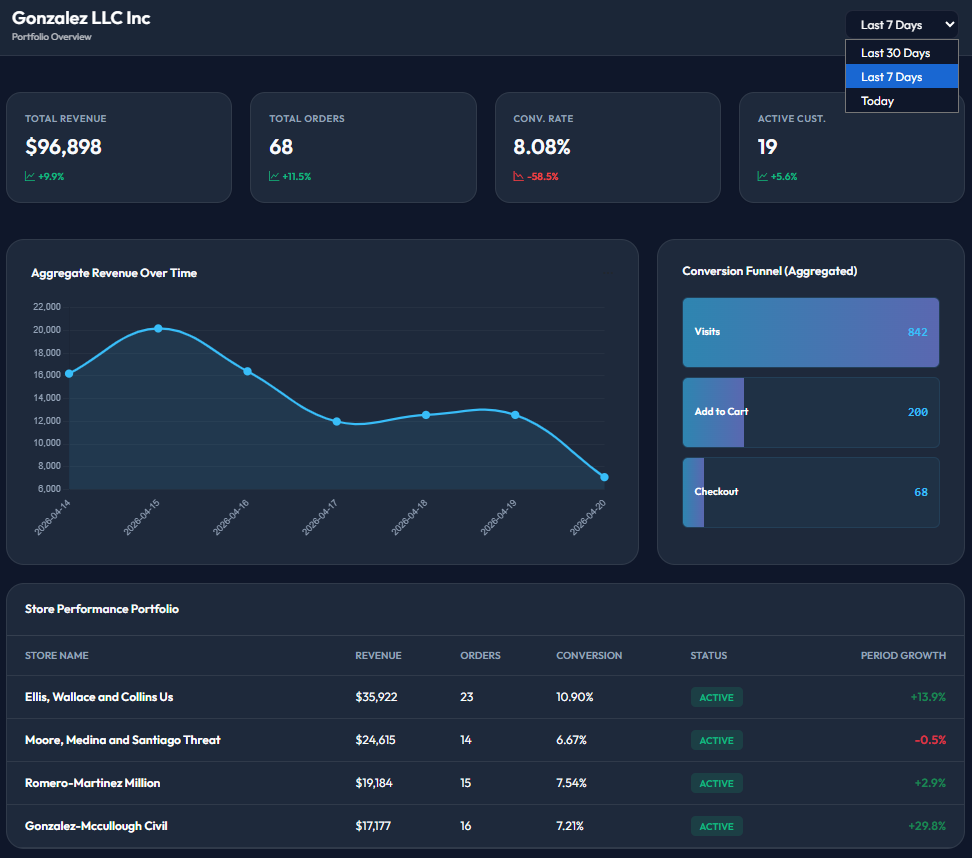
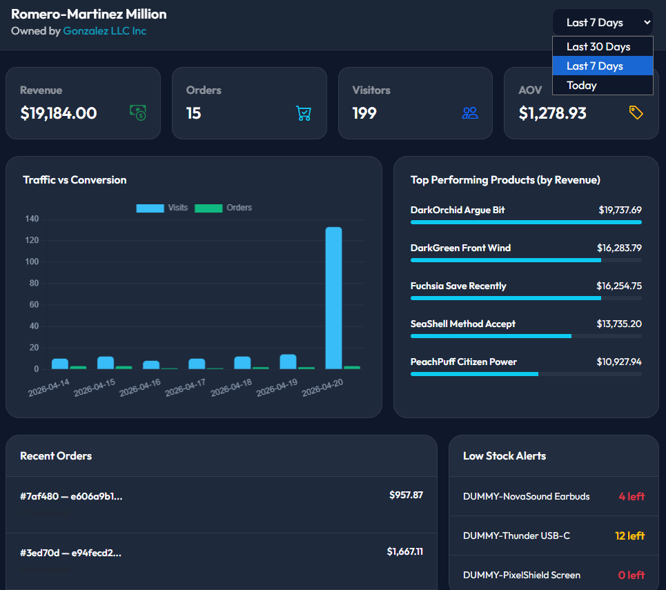

# Real-Time E-Commerce Data Platform

## About This Project
This is an **experimental sandbox project**. I built it to learn and practice modern data engineering tools. The goal is to mimic the real-time data architecture of high-growth e-commerce platforms.

It captures database changes (CDC) and user clickstream events, processes them in real-time, and stores them in a fast analytical database.

## Architecture & Tech Stack
- **Transactional Database:** PostgreSQL
- **Change Data Capture (CDC):** Debezium
- **Message Broker:** Apache Kafka
- **Stream Processing:** Apache Flink
- **OLAP Data Warehouse:** ClickHouse


## How to Use?

- Clone the project
  ```bash
  git clone https://github.com/Al-Moatasem/realtime-e-commerce-data-platform.git
  ```
- Copy the `.env.example` to `.env` and update its values
- Start the docker services
  ```bash
  # Run necessary docker services (excluding flink)
  docker compose -f infra/docker_compose/docker_compose.yaml up db kafka kafka-ui connect clickhouse -d

  # Or, Run all services
  docker compose -f infra/docker_compose/docker_compose.yaml up -d
  ```
  - The docker file include two services for Apache Flink, Flink is not used heavily on this project at this point (we only tested the connection from Flink to Kafka and ClickHouse)
  - The `db` service will
    - Create a postgres database named `ecommerce_db`
    - Create the application tables (merchants, stores, products, ...). (check: `infra\postgres\init\01_application_tables.sql`)
    - Create `debezium_user` user for the CDC tasks (check: `infra\postgres\init\02_debezium_user.sql`).
  - The `clickhouse` service will
    - Create a database named `dwh`, with one or more tables (check: `infra\clickhouse\config\init`)


### Web Applications - Data Faker
We have two separate FastAPI applications:
1. generating random clickstream events and push them into Kafka, and insert necessary records into a Postgres database
2. Consuming data from the ClickHouse database and feed the Merchant and Store dashboards.

---

- Navigate to the `data_faker` directory and create the Python virtual environment
  ```bash
  cd data_faker
  uv sync
  .venv/scripts/activate # Linux: source .venv/bin/activate
  ```
- Start the data faker application
  ```bash
  uv run uvicorn main:app --port 8000 --reload
  ```
- Open the data faker web application `http://localhost:8000`
  - The application depends on the Kafka service, if the Kafka Docker service was not yet started, the UI will display a warning, wait till the Kafka Service is up and running, then restart the data faker application (open `data_faker/main.py` and press **ctrl+s** to trigger the restart)

  

- We have different option to generate data
  - Use the play button for **MERCHANT TRAFFIC & SIMULATION** card to generate a random merchant with one/multiple stores, products, customers, orders on the Postgres database, and publish click events to Kafka, it will prompt a window with number of days for the historical data (default is 65 days)
    - We can trigger multiple data generation actions in the same time
  - Generate a continuous stream of events
    1. Seed the database with merchants, stores, products, customers through the **BULK DATA INITIALIZATION** play button
    2. Generate clickstream events through the **SESSION SIMULATOR** play button.
    3. Start a process that update the order status on the Postgres database through the **ORDER FULFILLMENT** play button.

    > We can run both session simulator and order fulfillment in the same time

### Kafka Connect / Debezium
- While replicating Postgres data into Kafka through Debezium, the default configurations will result in receiving only the `after` state, if we need to receive both the `before` and `after` states of the records, we need to set the replica set to true per table
  - Open the postgres container terminal and access the `psql`
    ```bash
    docker exec -it db bash
    psql -U app_admin -d ecommerce_db -w

    ```
  - Generate the SQL statements for available tables
    ```sql
    SELECT 'ALTER TABLE ' || quote_ident(schemaname) || '.' || quote_ident(tablename) || ' REPLICA IDENTITY FULL;'
    FROM pg_tables
    WHERE TRUE
        AND schemaname IN ('public')
        AND tablename NOT IN ('alembic_version')
    ;
    ```
  - Execute the result queries (the below queries)
    ```sql
    ALTER TABLE public.merchants REPLICA IDENTITY FULL;
    ALTER TABLE public.customers REPLICA IDENTITY FULL;
    ALTER TABLE public.orders REPLICA IDENTITY FULL;
    ALTER TABLE public.stores REPLICA IDENTITY FULL;
    ALTER TABLE public.subscriptions REPLICA IDENTITY FULL;
    ALTER TABLE public.order_lines REPLICA IDENTITY FULL;
    ALTER TABLE public.products REPLICA IDENTITY FULL;
    ```
- create the cdc connector that replicate data from Postgres db into Kafka
  ```bash
  curl -i -X PUT "http://localhost:8083/connectors/jdbc-pg-source-ecom-db/config" \
      -H "Accept:application/json" -H "Content-Type:application/json" \
      -d @streaming/connect/01_jdbc_source_postgres_ecommerce.json
  ```
  The expected response should be like this
  ```json
  {"name":"jdbc-pg-source-ecom-db","config":{"connector.class":"io.debezium.connector.postgresql.PostgresConnector",..."name":"jdbc-pg-source-ecom-db"},"tasks":[],"type":"source"}
  ```
- Check the status of the connector and its task
  ```bash
  curl -s "http://localhost:8083/connectors/jdbc-pg-source-ecom-db/status"
  ```
  expected response (we should expect `state = RUNNING` for both the connector and the task)
  ```json
  {
    "name":"jdbc-pg-source-ecom-db",
    "connector":{ "state":"RUNNING","worker_id":"172.18.0.6:8083","version":"3.5.0.Final"},
    "tasks":[{"id":0,"state":"RUNNING","worker_id":"172.18.0.6:8083","version":"3.5.0.Final"}],
    "type":"source"
  }
  ```
- We can check the created topics and replicated records through [kafka-ui](http://localhost:8080/ui/clusters/local-kafka/all-topics) (`http://localhost:8080/ui/clusters/local-kafka/all-topics`)

  

### ClickHouse

- Activate the virtual environment of the root project
  ```bash
  uv sync
  .venv/scripts/activate # Linux: source .venv/bin/activate
  ```
- Create a new ClickHouse database named `dwh_dbt` and integrate the Kafka topics as tables in that new database
  ```bash
  docker exec -it clickhouse-server bash
  clickhouse-client --multiquery < /opt/ch/sql/071_clickhouse_database_dbt.sql
  ```
  - Each created table with Kafka engine acts as a Kafka consumer, these tables don't store data.
- Revisit the `.env` file and update the values associated with ebt environment variables (if needed)
- Ensure that dbt is configured properly, we should expect **"All checks passed"** and no encountered errors
  ```bash
  dbt debug
  ```
- Run the dbt models
  ```bash
  dbt run
  ```

### Web Applications - Analytics API
- This application has no UI
- In a new terminal, navigate to the analytics api directory, activate the virtual environment and install necessary packages
  ```bash
  cd analytics_api
  uv sync
  .venv/scripts/activate # Linux: source .venv/bin/activate
  ```
- Start the analytics api application
  ```bash
  uv run uvicorn main:app --port 8003
  ```

---

- Assuming the data faker application still running and we have started the data generation for at least single merchant through the **MERCHANT TRAFFIC & SIMULATION** play button
  - If we clicked on the gear icon associated that card, a popup box will list the merchant name(s) and a link to their dashboard
- The merchant dashboard

  

- Clicking on any store name in the "Store Performance Portfolio" will redirect us to the store dashboard

  

  - ⚠ The **Low Stock Alerts** block (bottom-right) shows static data, the data generator doesn't generate/manage stock data.

### Apache Flink
- Currently there are two flink jobs that were built for testing the ability of connecting to Kafka as source/sink and to ClickHouse as a sink
- Start the Apache Flink docker services if they were not started
  ```bash
  docker compose -f infra/docker_compose/docker_compose.yaml up flink-jobmanager flink-taskmanager -d
  ```
- Open the flink job manager docker container
  ```bash
  docker exec -it flink-jobmanager bash
  ```
- Run flink job to replicate events from kafka topic to ClickHouse table
  ```bash
  ./bin/flink run \
    --python /opt/flink/flink-jobs/sql_02_source_kafka_sink_kafka.py

  ./bin/flink run \
    --python /opt/flink/flink-jobs/sql_03_source_kafka_sink_clickhouse.py
  ```

### Stop/Delete the Docker Assets
- Stop all the docker services
  ```bash
  docker compose -f infra/docker_compose/docker_compose.yaml down

  # stop containers + delete all volumes / remove orphan containers from this compose project
  docker compose -f infra/docker_compose/docker_compose.yaml down --remove-orphans --volumes
  ```

## What is Next?
This is an on-going project, I will keep updating it as much as possible, below are the TODO points:
- Kafka Connect
  - Passing credentials in a secure way
  - Using transformation to manage the sensitive information
  - Setup the Postgres database in a sharded way (one shard per region)
    - create different connector per shard that routes to a single topic for all database tables
    - split the Kafka messages into different topics per database table
    - How does a schema registry works in this situation?
- Adding Confluent schema registry
  - Apply changes to the Postgres tables
    - Add new fields
    - Drop fields
    - Rename fields
    - Alter field name
  - Use Avro
- Using Apache Flink
- Using Apache Iceberg with an object storage (S3/MinIO or GCS)
- ClickHouse
  - Use a multi-node server
  - Manage server configurations
  - Use Replica engines
- Using Prometheus and Grafana for observability
